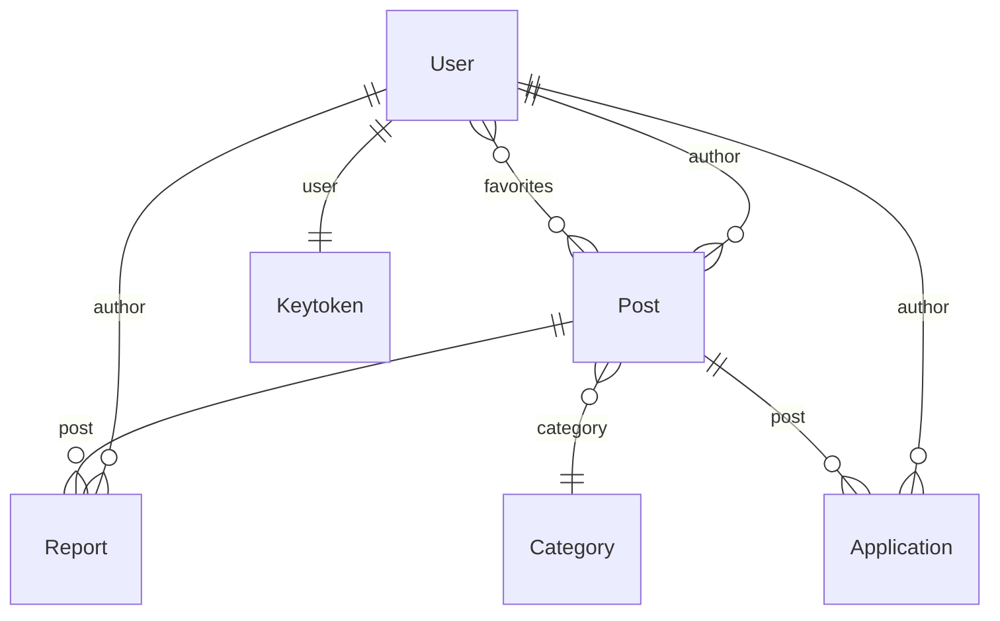

# 🗄️ Kiến Trúc: Database Models & Schema

## 1. Tổng Quan Models

## 2. Chi Tiết Schema

### User (Collection: "Users")
| Field | Type | Constraint |
|---|---|---|
| userName | String | max 150 |
| email | String | unique |
| password | String | required |
| phone | String | required |
| address | String | required |
| avatar | String | - |
| taxCode | String | - |
| status | Enum | "active" / "inActive" |
| verification | Boolean | default: false |
| roles | [String] | "ADMIN" / "PARTNER" / "USER" |
| favorites | [ObjectId→Post] | - |
| reviews | [ObjectId→Review] | - |
| invoiceInformation | Object | invoiceName, invoiceEmail, companyName, companyTaxCode, address |

### Post (Collection: "Posts")
| Field | Type | Constraint |
|---|---|---|
| title | String | 3-200 chars, required |
| description | String | required |
| overview | String | - |
| type | Enum | "RENT" / "SELL" |
| images | [{ filename, path }] | - |
| price | Number | >= 0, required |
| address | String | required |
| acreage | Number | - |
| category | ObjectId→Category | - |
| author | ObjectId→User | - |
| status | Enum | "in-stock" / "out-of-stock" |
| verification | Boolean | default: false |
| views | Number | default: 0 |
| favorites | Number | default: 0 |
| isDelete | Enum | "active" / "inActive" |

### Category (Collection: "Categories")
| Field | Type | Constraint |
|---|---|---|
| name | String | required, unique, max 100 |
| description | String | - |
| status | Enum | "active" / "inActive" |
| posts | [ObjectId→Post] | - |

### News (Collection: "Newss")
| Field | Type | Constraint |
|---|---|---|
| title | String | - |
| content | String | HTML |
| thumb | String | image path |
| tags | [String] | - |
| isDelete | Enum | "active" / "inActive" |

### Report (Collection: "Reports")
| Field | Type | Constraint |
|---|---|---|
| author | ObjectId→User | - |
| post | ObjectId→Post | - |
| phone | String | - |
| reason | String | - |
| content | String | - |
| status | Enum | "pending" / "resolved" / "rejected" |

### Application (Collection: "Applications")
| Field | Type | Constraint |
|---|---|---|
| name | String | required, max 100 |
| phone | String | required |
| email | String | required |
| content | String | required |
| post | ObjectId→Post | - |
| author | ObjectId→User | - |

### Keytoken (Collection: "Keys")
| Field | Type | Constraint |
|---|---|---|
| user | ObjectId→User | required |
| key | String | required |
